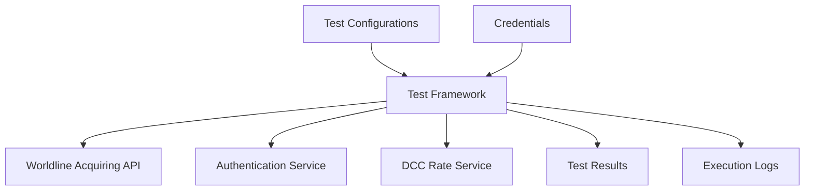
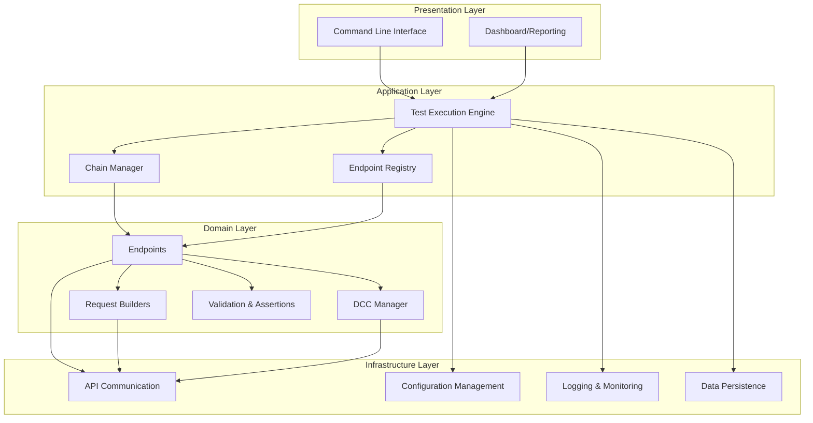
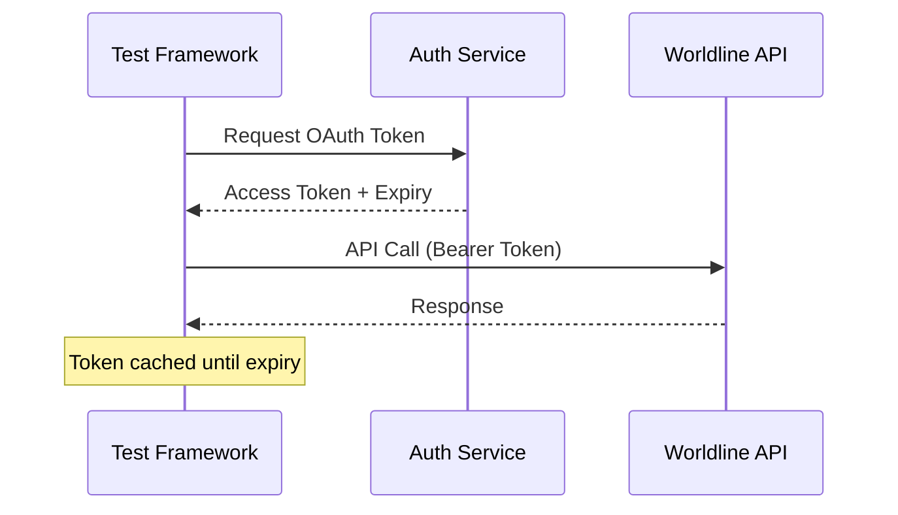
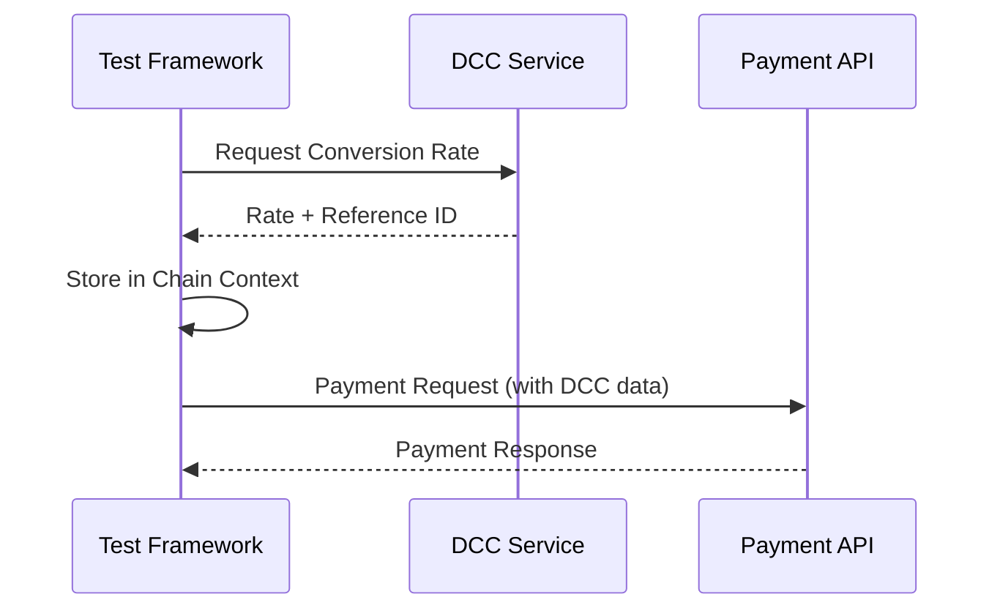
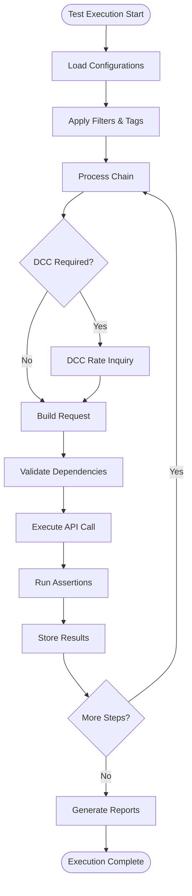

# Architecture Guide - Payment API Test Framework

## Table of Contents
- [Executive Summary](#executive-summary)
- [Architectural Overview](#architectural-overview)
- [Core Architectural Principles](#core-architectural-principles)
- [System Components](#system-components)
- [Integration Architecture](#integration-architecture)
- [Data Flow Architecture](#data-flow-architecture)
- [Cross-Cutting Concerns](#cross-cutting-concerns)
- [Design Patterns](#design-patterns)
- [Scalability & Extensibility](#scalability--extensibility)
- [Quality Attributes](#quality-attributes)
- [Technology Stack](#technology-stack)
- [Decision Records](#decision-records)

## Executive Summary

The Payment API Test Framework is a Python-based testing platform designed for comprehensive validation of Worldline Acquiring payment APIs. The architecture emphasizes **modularity**, **extensibility**, and **maintainability** through well-defined component boundaries and consistent design patterns.

### Key Architectural Achievements
- **Plugin Architecture**: Dynamic endpoint registration enables seamless addition of new payment methods
- **Chain-Based Workflow Engine**: Supports complex, stateful payment scenarios across multiple API calls
- **Centralized Request Construction**: Request Builder pattern ensures consistent API request formation
- **Cross-Cutting DCC Integration**: Dynamic Currency Conversion handled transparently across all payment operations
- **Configuration-Driven Testing**: Externalized test definitions enable non-technical test case management

## Architectural Overview

### System Context


### High-Level Architecture


## Core Architectural Principles

### 1. Separation of Concerns
**Principle**: Each component has a single, well-defined responsibility.

**Implementation**:
- **Endpoints**: Handle API communication and orchestration
- **Request Builders**: Construct and validate API requests
- **Managers**: Handle cross-cutting concerns (DCC, chains, configuration)
- **Utils**: Provide shared, stateless functionality

**Benefits**: High cohesion, low coupling, improved testability

### 2. Plugin Architecture
**Principle**: New functionality can be added without modifying existing code.

**Implementation**:
```python
@register_endpoint('new_payment_type')
class NewPaymentEndpoint(EndpointInterface):
    # Implementation automatically discovered and integrated
```

**Benefits**: Zero-impact extension, runtime discovery, simplified deployment

### 3. Configuration Over Code
**Principle**: Behavior is controlled through external configuration rather than code changes.

**Implementation**:
- Test scenarios defined in CSV files
- Environment configurations externalized
- Endpoint behavior controlled via metadata

**Benefits**: Non-technical test management, environment-specific behavior, reduced deployment risk

### 4. Immutable Request Construction
**Principle**: Request objects are built once and remain unchanged through the pipeline.

**Implementation**:
- Request Builders create complete, valid objects
- No modification after construction
- Validation at construction time

**Benefits**: Predictable behavior, easier debugging, thread safety

### 5. Fail-Fast Validation
**Principle**: Invalid configurations and states are detected as early as possible.

**Implementation**:
- Configuration validation at startup
- Request validation at construction
- Dependency validation before execution

**Benefits**: Faster feedback loops, easier troubleshooting, reduced test execution time

## System Components

### Endpoint Registry
**Purpose**: Central discovery and management of payment endpoints
**Pattern**: Registry + Factory
**Responsibilities**:
- Dynamic endpoint discovery
- Capability metadata management
- Endpoint lifecycle management

```python
class EndpointRegistry:
    @staticmethod
    def get_endpoint(endpoint_type: str) -> EndpointInterface
    
    @staticmethod 
    def endpoint_supports_dcc(endpoint_type: str) -> bool
    
    @staticmethod
    def get_endpoint_dependencies(endpoint_type: str) -> List[str]
```

### Request Builder Subsystem
**Purpose**: Centralized API request construction
**Pattern**: Builder + Strategy
**Responsibilities**:
- Request object construction
- Feature integration (DCC, 3DS, AVS, etc.)
- Request validation and cleaning

**Key Design Decision**: Request builders are pure functions that take data and context, return complete request objects.

### DCC Management System
**Purpose**: Handle Dynamic Currency Conversion across payment chains
**Pattern**: Context + Manager
**Responsibilities**:
- DCC rate inquiry orchestration
- Conversion context management across chains
- Currency calculation and validation

```python
class DCCManager:
    def get_chain_context(chain_id: str) -> DCCContext
    def update_context_from_dcc_response(chain_id: str, response: Any)
    def should_perform_dcc_inquiry(row: pd.Series) -> bool
```

### Chain Execution Engine
**Purpose**: Execute sequences of related API calls with shared state
**Pattern**: Pipeline + State Machine
**Responsibilities**:
- Chain dependency management
- State propagation between steps
- Error handling and recovery
- Result aggregation

### Configuration Management
**Purpose**: Centralized configuration loading and validation
**Pattern**: Repository + Factory
**Structure**:
```
config/
├── static/          # Cards, merchants, environments
├── credentials/     # API secrets (gitignored)
└── test_suites/     # Test definitions
```

## Integration Architecture

### External API Integration
**Pattern**: Adapter + Circuit Breaker
**Components**:
- **Worldline Acquiring SDK**: Primary payment API
- **Authentication Service**: OAuth2 token management
- **DCC Rate Service**: Currency conversion rates

**Key Decisions**:
- SDK abstraction prevents vendor lock-in
- Centralized authentication with token caching
- Graceful degradation when DCC unavailable

### Authentication Flow


### DCC Integration Flow


## Data Flow Architecture

### Test Execution Flow


### Data State Management
**Chain Context**: Maintains state across related API calls
- Payment IDs, transaction references
- DCC conversion data
- Assertion results

**Request Context**: Immutable data for single API call
- Test parameters
- Configuration data
- Previous step outputs

**Global Context**: System-wide state
- Authentication tokens
- Environment configuration
- Logging configuration

## Cross-Cutting Concerns

### Logging & Monitoring
**Architecture**: Structured logging with multiple outputs
- **Console**: Real-time execution feedback
- **File**: Detailed debugging information
- **Database**: Queryable execution history

**Implementation**:
```python
logger = logging.getLogger(__name__)
logger.info(f"[{chain_id}] API call: {call_type} - {duration}ms")
```

### Error Handling
**Strategy**: Fail-fast with graceful degradation
- **Configuration Errors**: Fail at startup
- **API Errors**: Fail chain, continue execution
- **DCC Errors**: Degrade to non-DCC execution

### Security
**Approach**: Defense in depth
- **Credential Isolation**: Separate config files, gitignored
- **Token Management**: Automatic refresh, secure storage
- **Input Validation**: All external data validated
- **Network Security**: HTTPS only, certificate validation

### Performance
**Strategy**: Optimize for test execution speed
- **Connection Pooling**: Reuse HTTP connections
- **Token Caching**: Minimize authentication requests
- **Parallel Execution**: Concurrent chain processing (configurable)
- **Lazy Loading**: Load configurations on demand

## Design Patterns

### 1. Registry Pattern (Endpoint Management)
**Problem**: Need to discover and manage various payment endpoints dynamically
**Solution**: Central registry with decorator-based registration
**Benefits**: Loose coupling, easy extension, runtime discovery

### 2. Builder Pattern (Request Construction)
**Problem**: Complex API requests with many optional features
**Solution**: Dedicated builders for each request type
**Benefits**: Consistent construction, testability, feature composition

### 3. Chain of Responsibility (Feature Application)
**Problem**: Multiple features (DCC, 3DS, AVS) need to modify requests
**Solution**: Sequential feature application in builders
**Benefits**: Feature independence, easy feature addition/removal

### 4. Context Pattern (DCC Management)
**Problem**: DCC data needed across multiple API calls in a chain
**Solution**: Chain-scoped context objects
**Benefits**: State isolation, clear data lifetime, easy testing

### 5. Strategy Pattern (Endpoint Implementations)
**Problem**: Different payment types need different API call strategies
**Solution**: Common interface with type-specific implementations
**Benefits**: Polymorphism, consistent interface, easy testing

### 6. Template Method (Test Execution)
**Problem**: Common execution flow with type-specific variations
**Solution**: Base execution template with overrideable steps
**Benefits**: Code reuse, consistent behavior, controlled variation

## Scalability & Extensibility

### Horizontal Scaling
- **Stateless Design**: All components are stateless (except chain context)
- **Parallel Execution**: Configurable thread-based concurrency
- **Database Sharding**: Results can be partitioned by environment/merchant

### Vertical Scaling
- **Memory Efficiency**: Streaming CSV processing, garbage collection optimization
- **CPU Optimization**: Efficient request construction, minimal serialization
- **I/O Optimization**: Connection pooling, batch operations

### Extensibility Points
1. **New Endpoints**: `@register_endpoint` decorator
2. **New Features**: Request builder enhancement
3. **New Assertion Types**: Assertion framework extension
4. **New Output Formats**: Reporter plugin system
5. **New Authentication**: Authentication adapter pattern

### Future Architecture Considerations
- **Microservices**: Split into execution engine + result service
- **Event Sourcing**: Capture all test events for replay/analysis
- **CQRS**: Separate read/write models for results
- **Container Orchestration**: Kubernetes deployment for cloud scaling

## Quality Attributes

### Maintainability
- **Clear Separation**: Well-defined component boundaries
- **Consistent Patterns**: Standard approaches across codebase
- **Comprehensive Tests**: Unit and integration test coverage
- **Documentation**: Architecture and developer guides

### Reliability
- **Error Recovery**: Graceful failure handling
- **Validation**: Early detection of invalid states
- **Retry Logic**: Automatic retry for transient failures
- **Monitoring**: Comprehensive logging and metrics

### Performance
- **Response Time**: Sub-second API call overhead
- **Throughput**: Hundreds of API calls per minute
- **Resource Usage**: Minimal memory footprint
- **Scalability**: Linear scaling with thread count

### Security
- **Authentication**: OAuth2 with token management
- **Authorization**: Environment-based access control
- **Data Protection**: Credential isolation and encryption
- **Audit Trail**: Complete execution logging

### Usability
- **CLI Interface**: Simple, intuitive command structure
- **Configuration**: CSV-based, non-technical friendly
- **Feedback**: Real-time execution progress
- **Results**: Multiple output formats (CSV, database, console)

## Technology Stack

### Core Technologies
- **Python 3.9+**: Primary language
- **Pandas**: Data manipulation and CSV processing
- **Requests**: HTTP client for API calls
- **SQLite**: Local result storage
- **Logging**: Python standard library

### Payment Integration
- **Worldline Acquiring SDK**: Official Python SDK
- **OAuth2**: Authentication protocol
- **REST APIs**: Worldline payment and DCC services

### Development & Testing
- **Pytest**: Unit and integration testing
- **Mock**: Test doubles and stubs
- **Coverage**: Code coverage measurement
- **Black**: Code formatting
- **mypy**: Static type checking

### Infrastructure
- **Git**: Version control
- **Virtual Environments**: Dependency isolation
- **CSV**: Configuration and test data format
- **JSON**: API request/response format

## Decision Records

### ADR-001: Request Builder Pattern
**Decision**: Centralize request construction in dedicated builder modules
**Rationale**: 
- Separation of concerns between API calls and request construction
- Easier testing of request building logic
- Consistent request structure across endpoints
**Trade-offs**: Additional abstraction layer, but improved maintainability

### ADR-002: Endpoint Registry Pattern
**Decision**: Use decorator-based registration for dynamic endpoint discovery
**Rationale**:
- Eliminates need to modify central registry when adding endpoints
- Supports plugin-style architecture
- Runtime discovery enables flexible test execution
**Trade-offs**: Slight performance overhead, but major maintainability gain

### ADR-003: CSV-Based Configuration
**Decision**: Use CSV files for test definitions and configuration
**Rationale**:
- Non-technical users can create/modify tests
- Easy integration with spreadsheet applications
- Simple data model for tabular test data
**Trade-offs**: Limited expressiveness vs. JSON/YAML, but improved accessibility

### ADR-004: Chain-Based Test Execution
**Decision**: Support sequences of related API calls with shared state
**Rationale**:
- Real payment workflows require multiple API calls
- State sharing necessary for realistic testing
- Dependency management essential for test reliability
**Trade-offs**: Increased complexity vs. simple isolated tests, but enables realistic scenarios

### ADR-005: Centralized DCC Management
**Decision**: Handle DCC as a cross-cutting concern with centralized management
**Rationale**:
- DCC applies to multiple payment types consistently
- Rate inquiry and context management are complex
- Centralization ensures consistent behavior
**Trade-offs**: Additional abstraction, but prevents DCC logic duplication

### ADR-006: Fail-Fast Validation Strategy
**Decision**: Validate configurations and dependencies early in execution
**Rationale**:
- Faster feedback for configuration errors
- Prevents partial test execution with invalid setup
- Clearer error messages for troubleshooting
**Trade-offs**: Upfront validation cost, but reduced debugging time

---

## Summary

This architecture successfully balances **flexibility** and **simplicity**, enabling comprehensive payment API testing while maintaining code quality and developer productivity. The modular design supports rapid extension for new payment methods and features, while the configuration-driven approach enables non-technical test management.

Key architectural strengths:
- **Extensible**: New endpoints added without core changes
- **Maintainable**: Clear separation of concerns and consistent patterns
- **Reliable**: Comprehensive error handling and validation
- **Performant**: Efficient execution with configurable concurrency
- **Secure**: Proper credential management and API security

The architecture positions the framework for future growth while meeting current testing requirements effectively.


This architecture guide covers:

- ✅ **High-level system design** and component interactions
- ✅ **Architectural principles** and rationale behind design decisions
- ✅ **Design patterns** used throughout the system
- ✅ **Scalability and extensibility** considerations
- ✅ **Quality attributes** (performance, security, maintainability)
- ✅ **Technology stack** and integration patterns
- ✅ **Decision records** documenting key architectural choices
- ✅ **Visual diagrams** using Mermaid for clarity
- ✅ **Future considerations** for system evolution

The guide is written for architects and senior engineers who need to understand the system's overall design, make informed decisions about extensions, and evaluate the architecture's fitness for purpose.